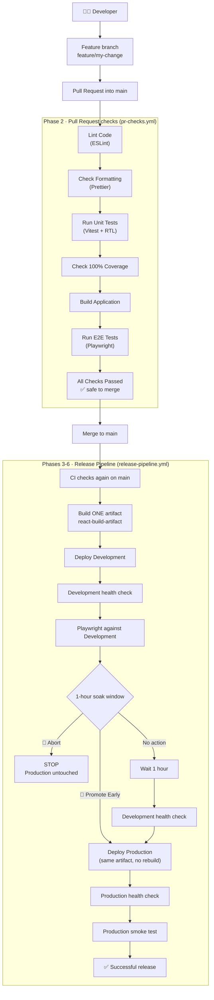

# CI/CD Todo Demo — a hands-on CI/CD training lab

This repository is a **deliberately tiny** React + TypeScript todo app wrapped in a **complete, real
CI/CD pipeline**. The app is boring on purpose. The pipeline is the lesson.

```
Developer writes code → Pull Request → CI checks → Merge → Build ONE artifact
→ Deploy to Development → Test Development → Soak (wait / promote / abort) → Deploy to Production
```

Nothing in the pipeline is faked: the checks, coverage enforcement, builds, artifacts, deployments,
health checks, and Playwright runs against the live sites are all real.

| Environment | URL                                                | Deployed from                                 |
| ----------- | -------------------------------------------------- | --------------------------------------------- |
| Development | `https://<your-username>.github.io/cicd-demo-dev/` | `gh-pages` branch of the `cicd-demo-dev` repo |
| Production  | `https://<your-username>.github.io/cicd-demo/`     | GitHub Pages of this `cicd-demo` repo         |

> For the GitHub account `elijahram` these are
> `https://elijahram.github.io/cicd-demo-dev/` and `https://elijahram.github.io/cicd-demo/`.

The app shows a colored **environment badge** (DEVELOPMENT / PRODUCTION / LOCAL) and, in the footer,
the **commit it was built from**. Open both sites after a release and you'll see the same commit in
both: that's "build once, promote the same artifact" made visible.

---

## Contents

1. [Tech stack](#tech-stack)
2. [Run it locally](#run-it-locally)
3. [Project layout](#project-layout)
4. [The whole pipeline in one diagram](#the-whole-pipeline-in-one-diagram)
5. [Setup guide (step by step)](#setup-guide-step-by-step)
6. [Hands-on labs: break things on purpose](#hands-on-labs-break-things-on-purpose)
7. [Understanding the CI/CD Pipeline](#understanding-the-cicd-pipeline)
8. [Workflow reference](#workflow-reference)
9. [GitHub Environments, secrets, variables and permissions](#github-environments-secrets-variables-and-permissions)
10. [How This Differs From a Real Production System](#how-this-differs-from-a-real-production-system)
11. [Troubleshooting](#troubleshooting)

---

## Tech stack

| Tool                           | Job in this project                                              |
| ------------------------------ | ---------------------------------------------------------------- |
| React + TypeScript             | The app                                                          |
| Vite                           | Dev server and production build (`dist/`)                        |
| ESLint                         | Code quality checks                                              |
| Prettier                       | Code formatting                                                  |
| Vitest + React Testing Library | Unit tests + 100% coverage enforcement                           |
| Playwright                     | End-to-end (E2E) browser tests, locally and against live sites   |
| GitHub Actions                 | Runs the whole pipeline                                          |
| GitHub Environments            | `development` and `production`, with their own secrets/variables |
| GitHub Pages                   | Free hosting for both environments                               |

---

## Run it locally

Requires Node.js 22 (see `.nvmrc`) and Git.

```bash
npm install                 # first time only (CI uses `npm ci`, explained below)
npx playwright install chromium   # first time only, downloads the E2E test browser

npm run dev                 # start the app at http://localhost:5173
npm run lint                # ESLint
npm run format              # Prettier: FIX formatting in all files
npm run format:check        # Prettier: only CHECK formatting (what CI runs)
npm run test                # unit tests (Vitest + React Testing Library)
npm run test:coverage       # unit tests + coverage report; fails below 100%
npm run build               # type-check + production build into dist/
npm run test:e2e            # Playwright E2E tests against the built app (run build first!)
npm run test:e2e:smoke      # only the small @smoke test (what Production runs)
```

`npm run test:e2e` serves the **built** `dist/` folder with `vite preview`, so run `npm run build`
first. After `npm run test:coverage`, open `coverage/index.html` in a browser to see line-by-line
coverage.

---

## Project layout

```
cicd-demo/
├── src/
│   ├── App.tsx               # the whole todo app
│   ├── environment.ts        # figures out Dev/Prod/Local from the URL + build info
│   ├── main.tsx              # mounts <App /> into index.html
│   ├── index.css
│   ├── *.test.ts(x)          # unit tests (Vitest + React Testing Library)
│   └── setupTests.ts
├── tests/e2e/                # Playwright tests
│   ├── todo.spec.ts          # full user journey (PR + Development)
│   ├── smoke.spec.ts         # tiny @smoke test (Production)
│   └── helpers.ts
├── scripts/
│   ├── fingerprint.sh        # SHA-256 of the whole build → proves "same artifact"
│   ├── health-check.sh       # HTTP 200 check with retries
│   ├── wait-for-release.sh   # waits until a site serves a specific commit
│   └── release-status.sh     # reads/writes the "release-control" commit status
├── .github/
│   ├── actions/setup-project/action.yml   # shared "setup Node + npm ci" steps
│   └── workflows/
│       ├── ci-checks.yml            # reusable: lint → format → tests → coverage → build → E2E
│       ├── pr-checks.yml            # Phase 2: runs ci-checks on every Pull Request
│       ├── release-pipeline.yml     # Phases 3-6: main → Dev → soak → Prod
│       ├── deploy-production.yml    # reusable: deploy + smoke-test Production
│       ├── promote-early.yml        # Option 2: 🚀 Promote Development to Production NOW
│       └── abort-release.yml        # Option 3: 🛑 Abort Development Release
├── vite.config.ts            # Vite + Vitest + 100% coverage thresholds
├── playwright.config.ts
├── eslint.config.js
└── .prettierrc.json
```

---

## The whole pipeline in one diagram



---

## Setup guide (step by step)

You need Git, Node.js 22, and a GitHub account. Everything below uses the GitHub website. Replace
`<your-username>` with your GitHub username everywhere.

> **Both repositories must be public.** GitHub Pages is free for public repositories. Public repos
> also get unlimited free GitHub Actions minutes, which matters because the soak job keeps a runner
> busy for an hour.

### 1. Create the GitHub repositories

You need **two** repositories because one GitHub repository can host only one GitHub Pages site.

1. **`cicd-demo`**: github.com → **+** (top right) → **New repository**
   - Name: `cicd-demo`, **Public**
   - Do **not** add a README, .gitignore or license (the repo must be empty).
2. **`cicd-demo-dev`**: **New repository** again
   - Name: `cicd-demo-dev`, **Public**
   - ✅ **Add a README file** (it needs at least one commit)
   - This repo holds **no source code**. The pipeline pushes the built website into its `gh-pages`
     branch.
3. In `cicd-demo-dev`, create the `gh-pages` branch: on the repo's main page, click the branch
   dropdown (says `main`) → type `gh-pages` → **Create branch gh-pages from main**.

### 2. Push the project

From the project folder on your computer:

```bash
npm install
git init -b main
git add .
git commit -m "Initial commit: CI/CD demo"
git remote add origin https://github.com/<your-username>/cicd-demo.git
git push -u origin main
```

This push to `main` immediately starts the **Release Pipeline** (Actions tab). The CI jobs will go
green, then **Deploy Development will fail** with `DEV_PAGES_DEPLOY_TOKEN is not set`. **That is
expected.** We add that secret in step 6 and re-run the pipeline.

### 3. Enable GitHub Pages

**Production** (`cicd-demo` repo):

- Settings → Pages → **Build and deployment** → Source: **GitHub Actions**

**Development** (`cicd-demo-dev` repo):

- Settings → Pages → Source: **Deploy from a branch** → Branch: **`gh-pages`**, folder **`/ (root)`**
  → **Save**

Why two different methods? Production is deployed by this repo's own workflow with GitHub's
official `actions/deploy-pages`. Development lives in a different repo, so we deploy it the simplest
cross-repo way: push the files to the `gh-pages` branch, and GitHub Pages serves that branch.

### 4. Configure GitHub Actions

In `cicd-demo` → Settings → Actions → General:

- **Actions permissions:** "Allow all actions and reusable workflows" (the default).
- **Workflow permissions:** "**Read repository contents and packages permissions**" (read-only).
  Our workflows ask for extra permissions only on the specific jobs that need them (see
  [permissions](#github-action-permissions-least-privilege)).

### 5. Create the Development and Production environments

In `cicd-demo` → Settings → **Environments**. The first pipeline run may have created them already.
If so, click each one to edit it; otherwise click **New environment**.

**`development`**

- Nothing is required besides the secret in step 6.
- Optional **environment variables** (Add environment variable):
  - `APP_URL` = `https://<your-username>.github.io/cicd-demo-dev/`
  - `PAGES_REPO` = `<your-username>/cicd-demo-dev`

  (If you skip these, the workflow uses exactly these values by default.)

**`production`**

- **Deployment branches and tags** → change "No restriction" to **Selected branches and tags** →
  **Add deployment branch or tag rule** → `main`. Now only code on `main` can ever reach
  Production.
- Optional: environment variable `APP_URL` = `https://<your-username>.github.io/cicd-demo/`
  (for your own reference; the real Production URL comes from GitHub Pages).

### 6. Create the secret (a fine-grained Personal Access Token)

**Why do we need a token?** Every workflow run gets an automatic `GITHUB_TOKEN`, but it can only
access **the repository the workflow is running in** (`cicd-demo`). Deploying Development means
pushing files to a **different** repository (`cicd-demo-dev`), so we need a token that can write to
that one repo, and only that repo.

**Create the token:**

1. github.com → your avatar → **Settings** → **Developer settings** → **Personal access tokens** →
   **Fine-grained tokens** → **Generate new token**
2. Name: `cicd-demo-dev deploy`. Expiration: 90 days (or whatever you prefer).
3. **Repository access:** **Only select repositories** → pick **`cicd-demo-dev`** only.
4. **Permissions** → Repository permissions → **Contents: Read and write**. (Metadata: Read-only is
   added automatically.) **Nothing else.**
5. **Generate token** and copy it (you won't see it again).

With that token, the worst anyone could do is change files in `cicd-demo-dev`. That's
**least privilege**.

**Store it as a secret** in `cicd-demo`:

- Settings → Environments → **development** → **Environment secrets** → **Add environment secret**
  - Name: `DEV_PAGES_DEPLOY_TOKEN`
  - Value: the token

We use an _environment_ secret (not a repository secret) so only jobs that deploy to `development`
can read it. If you prefer a repository secret, the path is Settings → **Secrets and variables** →
**Actions** → **New repository secret**, with the same name. The workflow works either way.

That is the **only** secret this project needs. Production uses GitHub's built-in OIDC
(`id-token: write`) to deploy to its own Pages site, so it needs no stored credentials.

**Now re-run the first pipeline:** Actions → **Release Pipeline** → the failed run → **Re-run all
jobs**. Watch it deploy Development, test it, and start the soak.

### 7. Configure branch protection

This stops anyone from merging code into `main` unless CI is green.

`cicd-demo` → Settings → **Rules** → **Rulesets** → **New ruleset** → **New branch ruleset**:

- Ruleset name: `protect-main`, Enforcement status: **Active**
- Target branches → **Add target** → **Include default branch**
- ✅ **Require a pull request before merging** (set required approvals to **0** if you work alone;
  you can't approve your own PR)
- ✅ **Require status checks to pass** → **Add checks** → type `All Checks Passed` → select
  **`CI / All Checks Passed`**
  - ✅ **Require branches to be up to date before merging** (recommended)
- ✅ **Block force pushes**
- **Create**

> The check only appears in the search box after it has run at least once, which happens when you
> open your first PR (step 9). If you can't find it yet, come back after step 10.

(Classic alternative: Settings → Branches → **Add classic branch protection rule** for `main` with
the same options.)

**Why require only one check?** `All Checks Passed` is a "gate" job that depends on every other CI
job and **fails unless all of them succeeded**. Requiring just the gate means you won't have to
update branch protection when a check is added or renamed.

### 8. Open your first feature branch

```bash
git checkout main
git pull
git checkout -b feature/add-todo-counter
```

Make a small, visible change. For example, in `src/index.css` change the `.env-development`
background color from `#bf8700` to `#8250df` (purple). Then:

```bash
# optional local checks (CI will enforce them anyway)
npm run lint && npm run format:check && npm run test:coverage && npm run build && npm run test:e2e

git add .
git commit -m "Make the Development badge purple"
git push -u origin feature/add-todo-counter
```

### 9. Open a Pull Request

GitHub shows a **Compare & pull request** banner. Click it (base: `main` ← compare:
`feature/add-todo-counter`) → **Create pull request**.

### 10. Watch CI execute

On the PR, click **Details** next to a check (or open the **Actions** tab → **Pull Request
Checks**). You'll see the graph:

```
Lint Code → Check Formatting → Run Unit Tests → Check 100% Coverage → Build Application → Run E2E Tests → All Checks Passed
```

Click any job to watch its live log. The run's **Summary** page shows the coverage table and the
`react-build-artifact` you can download.

### 11. Merge the Pull Request

When everything is green, click **Merge pull request**. Merging pushes to `main`, which starts the
**Release Pipeline**.

### 12. Watch Development deploy

Actions → **Release Pipeline** → the newest run. The graph shows:

```
CI on main (all 7 jobs again) → Deploy Development → Test Development → Development Soak → Production
```

**Deploy Development** pushes the artifact to `cicd-demo-dev`, then waits until the live site
reports the new commit in `/release.json`. **Test Development** runs a health check and the full
Playwright suite against the real URL.

### 13. Open the Development URL

`https://<your-username>.github.io/cicd-demo-dev/`: you should see the yellow **DEVELOPMENT** badge,
and the footer shows the commit from your merge. The URL is also clickable on the **Deploy
Development** box in the workflow graph.

### 14. Test it manually

Add, complete and delete some todos. Resize the browser to phone width. This is exactly what the
soak window is for: a human looking at the real deployed app. Meanwhile, the **Development Soak**
job logs a countdown every minute.

> **Tip while learning:** 60 minutes is a long time to wait. Add a **repository variable**
> `SOAK_MINUTES` = `5` (Settings → Secrets and variables → Actions → **Variables** tab → New
> repository variable). Delete it later to go back to 60.

### 15. Promote early

Actions → left sidebar → **🚀 Promote Development to Production NOW** → **Run workflow** → type
`PROMOTE` → **Run workflow**.

It identifies the release currently in Development, checks it's healthy and not aborted, and deploys
the **same artifact** to Production. The run summary says **EARLY MANUAL PROMOTION**. Within a
minute, the **Development Soak** job in the Release Pipeline notices and ends with _"Release was
already promoted EARLY"_.

### 16. Abort a future release

Make another feature branch and PR, then merge it. When the Release Pipeline reaches **Development
Soak**:

Actions → **🛑 Abort Development Release** → **Run workflow** → reason: `Layout broken on mobile` →
**Run workflow**.

Within a minute the soak job stops, and a green **Release Aborted (Production skipped)** job appears.
The Production job is **skipped**. The commit on `main` shows a red ✗ labelled
`release-control — ABORTED by @you: Layout broken on mobile`. Production still runs the previous
release.

### 17. Let another release promote automatically

Merge one more PR and do **nothing**. After the soak window (60 min, or your `SOAK_MINUTES`) the
soak job:

1. checks the release wasn't aborted,
2. health-checks Development and confirms it still serves this release,
3. hands off to **Deploy Production** → **Production Smoke Test**.

The summary says **AUTOMATIC PROMOTION after the Development soak window**.

### 18. Open the Production URL

`https://<your-username>.github.io/cicd-demo/`: green **PRODUCTION** badge, and the footer shows
**the same commit and run number** as Development. Same artifact, two environments.

---

## Hands-on labs: break things on purpose

Do each on its own feature branch, open a PR, watch the pipeline turn red, then fix it and watch it
turn green. **Never merge a red PR** (branch protection won't let you).

| Lab                  | What to change                                                                                                                                                                     | Job that fails        |
| -------------------- | ---------------------------------------------------------------------------------------------------------------------------------------------------------------------------------- | --------------------- |
| 1. Break linting     | In `App.tsx` add `const unused = 1;` inside `App()`                                                                                                                                | Lint Code             |
| 2. Break formatting  | Change `const remaining = ` to `const   remaining   = ` and **don't** run `npm run format`                                                                                         | Check Formatting      |
| 3. Break a unit test | In `App.tsx` change the word `remaining` in `{remaining === 1 ? 'todo' : 'todos'} remaining` to `left`                                                                             | Run Unit Tests        |
| 4. Reduce coverage   | Add an untested function to `environment.ts`: `export function unused() { return 1; }`                                                                                             | Check 100% Coverage   |
| 5. Break an E2E test | In `tests/e2e/todo.spec.ts` change `{ name: 'Add' }` to `{ name: 'Save' }`                                                                                                         | Run E2E Tests         |
| 6. Break the build   | In `App.tsx` add `const title: number = 'CI/CD Todo Demo';` and use it: `<h1>{title}</h1>` (lint and unit tests still pass; the TypeScript type check in `npm run build` does not) | Build Application     |
| 7. Fix everything    | Undo your changes (`git checkout main -- .`), commit, push                                                                                                                         | Nothing, all green ✅ |

Notice that each failure **stops everything after it**: when lint fails, tests never even start. Also
notice that **nothing gets deployed** from any PR, even a green one.

Then practice the release decisions: [promote early](#15-promote-early),
[abort](#16-abort-a-future-release), and [automatic promotion](#17-let-another-release-promote-automatically).

---

## Understanding the CI/CD Pipeline

### What is Continuous Integration?

**Continuous Integration (CI)** means every time a developer tries to _integrate_ their changes into
the shared code (`main`), a machine automatically checks that the changes are safe. Humans forget
to run tests; CI never forgets.

```
Feature Branch → Pull Request → Automated Checks → Merge
```

- **Feature branch:** your own copy of the code to work on (`feature/add-todo-counter`). `main` is
  untouched while you work.
- **Pull Request (PR):** "I'd like to merge my branch into `main`." Teammates review it, and CI
  checks it.
- **Automated checks:** GitHub Actions runs `pr-checks.yml` on every PR and every new push to it.
- **Merge:** allowed only when checks are green (enforced by branch protection).

`main` is the **production branch**: whatever is on `main` is on its way to users. Protecting it is
the whole point.

**Local checks vs CI:** You _can_ run `npm run lint`, `npm run test`, etc. locally before pushing,
and it's a good habit because it's faster feedback. But it's **optional**. GitHub Actions runs the
same checks on every PR, and branch protection **enforces** them. You can't forget.

### Why each check exists

| Check                | Question it answers                                 |
| -------------------- | --------------------------------------------------- |
| **ESLint**           | Does the code contain known bugs or bad patterns?   |
| **Prettier**         | Is the code formatted the team's way?               |
| **Unit tests**       | Does each piece of app behavior work?               |
| **Coverage**         | Did the tests actually execute all of the code?     |
| **Build**            | Can the app be turned into deployable files at all? |
| **Playwright (E2E)** | Does the finished app work in a real browser?       |

They're ordered cheapest/fastest first, so obvious problems fail in seconds instead of after a slow
browser test.

#### ESLint

ESLint checks **code quality**. It reads your code without running it and catches certain bugs or
bad coding patterns before code is merged: unused variables, a React hook called inside an `if`
(which causes subtle bugs), `any` types that defeat TypeScript, and more. Config:
`eslint.config.js`. The CI pipeline fails if linting fails (`--max-warnings 0` makes even warnings
fail).

#### Prettier

Prettier is the project **formatter**: quotes, semicolons, indentation, line length. It keeps code
formatting consistent across developers so code reviews focus on logic, not on spacing arguments,
and diffs don't fill up with whitespace changes.

- `npm run format` **rewrites** files into the standard format.
- `npm run format:check` only **checks** (never edits). CI runs this and fails if any file doesn't
  match. The fix is always: run `npm run format`, commit.

ESLint and Prettier don't fight because `eslint-config-prettier` turns off ESLint's formatting rules.
ESLint handles quality, Prettier handles formatting.

### Unit tests (Vitest + React Testing Library)

**Unit tests** check individual pieces of application behavior **quickly and in isolation**. They
don't open a real browser or a real website. Vitest runs them in a simulated browser (jsdom), and
React Testing Library lets tests interact with components the way a user would: find the input by
its label, type, click the button.

Example from `src/App.test.tsx`:

```tsx
it('adds a todo and clears the input', async () => {
  const { input, addTodo } = setup(); // render <App /> in the simulated browser
  await addTodo('Learn CI/CD'); // type into the input and click "Add"

  expect(within(list).getByText('Learn CI/CD')).toBeInTheDocument();
  expect(input).toHaveValue('');
  expect(screen.getByTestId('remaining')).toHaveTextContent('1 todo remaining');
});
```

All 13 unit tests run in a couple of seconds, which is why they run before the slower checks.

### Coverage

**Coverage** measures _which parts of the code were executed_ while the unit tests ran:

| Metric         | Meaning                                                          | Example in this app                                                       |
| -------------- | ---------------------------------------------------------------- | ------------------------------------------------------------------------- |
| **Statements** | % of individual statements executed                              | `setText('')` ran at least once                                           |
| **Branches**   | % of decision paths taken (both sides of every `if`, `?:`, `??`) | `remaining === 1 ? 'todo' : 'todos'`: tests must hit **both** 1 and not-1 |
| **Functions**  | % of functions called at least once                              | `addTodo`, `toggleTodo`, `deleteTodo`, `getEnvironment`...                |
| **Lines**      | % of source lines executed                                       | similar to statements, counted per line                                   |

The thresholds are configured explicitly in `vite.config.ts`:

```ts
thresholds: { statements: 100, branches: 100, functions: 100, lines: 100 }
```

If any number drops below 100, `npm run test:coverage` exits with an error and the **Check 100%
Coverage** job fails.

**Why 100% here?** This project exists for learning, and the app is tiny, so 100% is realistic. It
also makes [Lab 4](#hands-on-labs-break-things-on-purpose) instantly visible. **Real production
systems do not necessarily require 100% coverage.** Many teams pick 70-90% because the last few
percent often cost more than they're worth.

**100% coverage does NOT mean there are no bugs.** Coverage proves code _ran_ during a test, not that
the test _checked the right thing_. A test that renders the app and asserts nothing can still produce
100% coverage. Coverage also can't tell you about a broken mobile layout, a typo in the UI, or a
feature that was never written.

### Playwright (E2E tests)

**End-to-end (E2E) tests** use a **real browser** (Chromium) and interact with the **complete,
built app** like a real user:

```
open website → type todo → click "Add" → verify todo appears → check it → delete it → verify it's gone
```

See `tests/e2e/todo.spec.ts`. In this project Playwright runs **three times** per release:

| When              | Against                                            | Tests                        |
| ----------------- | -------------------------------------------------- | ---------------------------- |
| Before merge (PR) | the built artifact served locally (`vite preview`) | full suite                   |
| After Dev deploy  | the **real Development URL**                       | full suite                   |
| After Prod deploy | the **real Production URL**                        | only the small `@smoke` test |

When testing a deployed site, the tests also assert that the page shows the **expected commit** and
the **expected environment badge**, so they can't accidentally pass against an old cached version.

**Unit vs E2E: why both?**

|               | Unit tests (Vitest + RTL)                  | E2E tests (Playwright)                               |
| ------------- | ------------------------------------------ | ---------------------------------------------------- |
| What runs     | one component/function in a fake browser   | the whole built app in a real browser                |
| Speed         | milliseconds per test                      | seconds per test                                     |
| When it fails | points at the exact broken piece           | tells you "the user journey is broken", less precise |
| Catches       | logic bugs, edge cases (empty input, etc.) | build/bundling problems, wiring, real browser issues |

Unit tests are fast and precise, so you can have many. E2E tests are slower but prove the real thing
works. Teams use lots of unit tests and a few important E2E journeys (the "testing pyramid").

### Build

`npm run build` does two things:

1. `tsc -b`: TypeScript type-checks the whole project (a type error fails the build).
2. `vite build`: Vite converts the source application (TypeScript, JSX, CSS, imports) into
   **static production files** inside `dist/`: minified, bundled, with content-hashed file names.

```
dist/
├── index.html
├── favicon.svg
├── .nojekyll
├── release.json          ← added by CI: commit, run, fingerprint
└── assets/
    ├── index-BEPWsjes.js ← all of React + your app, minified
    └── index-beAIC1-w.css
```

**Those files are what actually get deployed.** Browsers never see `App.tsx`; they get `dist/`.

`vite.config.ts` sets `base: './'` so every asset URL is **relative**. That's what lets the
identical `dist/` work both under `/cicd-demo-dev/` and `/cicd-demo/`.

### Build artifacts

A **build artifact** is the output of a build, saved and versioned so later steps can use it.

```
Source code                      Build artifact
src/                             dist/
  App.tsx          npm run         index.html
  environment.ts   ─────────►      assets/index-<hash>.js
  main.tsx          build          assets/index-<hash>.css
  index.css                        release.json
```

The **Build Application** job uploads `dist/` as a GitHub Actions artifact named
**`react-build-artifact`**, attached to that workflow run (download it from the run's Summary page).
Every later stage **downloads** it instead of building again.

#### Build once, promote the same artifact

This is one of the most important ideas in CD.

❌ **Don't:**

```
Build → Development → Build again → Production
```

The second build might differ: a dependency published a new patch version, a different Node
version, a different environment variable. Then Production runs something **nobody tested**.

✅ **Do:**

```
              Build
                ↓
          Build Artifact
             /     \
            ↓       ↓
          DEV  →  PROD
```

Production must receive **the exact files that were tested in Development**. This project proves it
with a **fingerprint**: `scripts/fingerprint.sh` computes one SHA-256 hash over every file in the
build. The hash is computed at build time, **re-checked before every deploy** (the deploy fails on a
mismatch), and finally compared against what the live Production site serves. Change one byte and
the fingerprint changes.

It's also why the app can't have "this is Development" baked in at build time. Instead,
`src/environment.ts` looks at the URL at runtime to decide which badge to show.

### Continuous Delivery / Continuous Deployment

CI ends at "the code on `main` is valid." **CD** is everything after: getting that code to users
safely.

```
main → build → development → verification → production
```

- **Continuous Delivery:** every change is automatically built, tested and deployed to a
  pre-production environment, so it's **always ready** to release. A **human decides** when it
  goes to Production.
- **Continuous Deployment:** every change that passes all automated checks goes to Production
  **automatically**, with no human decision.

This project demonstrates both: if nobody acts, the release goes out on its own after the soak
(continuous deployment); **Promote Early** and **Abort** let a human make the call (continuous
delivery).

### The Development environment

Companies deploy to a **Development / Staging** environment before Production because tests on a
build server aren't the same as the app **actually deployed** on real infrastructure: real URLs,
real CDN, real hosting config. Deploying to Development first gives:

- **automated systems** a chance to test the real deployed app (health check + Playwright against the
  live Dev URL), and
- **humans** a chance to look at it, click around, try it on a phone.

If anything is wrong, only the team sees it, not users.

### The soak period

A **soak period** is a deliberate waiting period where a release "soaks" in an environment before
moving on. Many real problems only show up over time or with humans looking: slow memory leaks,
errors that only happen occasionally, something that "just looks wrong".

Here, after Development passes automated testing, the release stays in Development for **1 hour**.
During that hour anyone can open the Development URL and test manually. Then one of three things
happens:

```
                 Start 1-hour soak
        ┌───────────────┼────────────────┐
  Promote Early       Abort          No action
        ↓               ↓                ↓
    Production        STOP          wait 1 hour
                                         ↓
                                   Dev health check
                                         ↓
                                     Production
```

**How it works:** the soak job, the Promote workflow and the Abort workflow are separate runs, so they
need a shared place to record decisions. We use a GitHub **commit status** called `release-control`
on the release commit, the same mechanism that shows ✓/✗ next to commits:

| Status     | Meaning                                                       |
| ---------- | ------------------------------------------------------------- |
| 🟡 pending | soaking in Development                                        |
| 🔴 failure | **aborted** by a developer (or superseded by a newer release) |
| 🟢 success | promoted to / live in Production                              |
| 🔴 error   | a Production deployment or smoke test failed                  |

The soak job checks it every minute. You can see it next to the commit on GitHub.

If another PR is merged during the soak, the new release replaces the old one in Development. The
old release's soak job notices ("superseded") and **won't** promote. We never promote something
that isn't what people are currently testing.

### Promote early

If Development has been tested thoroughly and everything looks right, waiting the rest of the hour
is pointless. **🚀 Promote Development to Production NOW** (a `workflow_dispatch` workflow, i.e. a
manual "Run workflow" button) promotes it immediately. It:

1. identifies the release currently in Development (reads `/release.json` from the Dev site),
2. verifies Development is healthy,
3. confirms the release isn't aborted (or already promoted),
4. downloads the **same artifact** from the original pipeline run,
5. deploys it to Production without rebuilding,
6. labels the run **EARLY MANUAL PROMOTION**.

### Abort release

Automated tests can't detect every possible problem. Example: **all tests pass, but the layout
looks broken on mobile.** No unit test or E2E test checked the layout at phone width.

A developer notices this in Development and runs **🛑 Abort Development Release** with a reason. The
release is marked aborted, the soak job stops, Production is **not** touched, and the pipeline shows
a **Release Aborted (Production skipped)** job, so it's clear the stop was intentional and not a
random failure. The team then fixes the issue on a new branch and opens another PR, which goes
through the whole pipeline again.

### Automatic promotion

If nobody aborts or promotes early, then after 1 hour:

```
Check release wasn't aborted → Development health check → Production deployment
```

happens automatically, deploying the **same artifact** (no rebuild).

### Production smoke test

After deploying to Production we still test it, with a small **smoke test**: the app loads, the
heading exists, a user can add one todo. Why, if Development already passed everything?

- The **deployment itself** could have failed or been partial even though Development worked
  (wrong settings, a Pages outage, a caching problem, a missing file).
- Production is configured differently from Development (different repo, different deployment
  method in this project).

The smoke test is intentionally **small and non-destructive**: in a real system you don't want to
create fake orders or spam real users. (Here todos live only in browser memory, so it's harmless.)

**If the Production smoke test fails:** the job turns red, the release gets a `release-control`
**error** status, and the summary explains what happened. Real companies often **roll back
automatically** (re-deploy the previous good version). This project doesn't, to keep things simple.
To roll back by hand, open the Release Pipeline run of the last good release and **re-run its
Deploy Production job**, or revert the bad commit through a new PR.

### GitHub Environments

A **GitHub Environment** (`development`, `production`) is a named deployment target in your repo.
Each one can have:

- its own **secrets** (e.g. `DEV_PAGES_DEPLOY_TOKEN` exists only in `development`),
- its own **variables** (`APP_URL`),
- **protection rules** (Production accepts deployments only from `main`; you could also add
  required reviewers or a wait timer),
- a **deployment history** with URLs (repo main page → **Deployments**).

**Why companies separate Development and Production:** Production is where real users and real
data are. Separate environments mean mistakes in Development hurt nobody, credentials for one can't
touch the other, and stricter rules can be applied where the stakes are highest.

### GitHub Action permissions (least privilege)

Every workflow run gets a `GITHUB_TOKEN`. By default it can have broad access. If a malicious
dependency or a compromised third-party action runs in your workflow, it can do anything that token
allows. So we give each job **only what it needs**:

- workflows start with `permissions: {}` (nothing) or `contents: read`,
- then individual jobs add what they need:

| Permission        | Used by                              | Why                                            |
| ----------------- | ------------------------------------ | ---------------------------------------------- |
| `contents: read`  | almost all jobs                      | check out the code                             |
| `actions: read`   | Deploy Production                    | download an artifact from another workflow run |
| `pages: write`    | Deploy Production                    | publish to GitHub Pages                        |
| `id-token: write` | Deploy Production                    | prove to GitHub Pages who is deploying (OIDC)  |
| `statuses: write` | Soak, Deploy/Smoke Production, Abort | read/write the `release-control` commit status |
| `statuses: read`  | Promote Early                        | read the `release-control` status              |

PR workflows get **read-only** access, which is part of why PRs can never deploy.

---

## Workflow reference

| Workflow file           | Name in Actions tab                        | Trigger                       |
| ----------------------- | ------------------------------------------ | ----------------------------- |
| `pr-checks.yml`         | Pull Request Checks                        | PR into `main` opened/updated |
| `release-pipeline.yml`  | Release Pipeline                           | push to `main` (merge)        |
| `promote-early.yml`     | 🚀 Promote Development to Production NOW   | manual (Run workflow)         |
| `abort-release.yml`     | 🛑 Abort Development Release               | manual (Run workflow)         |
| `ci-checks.yml`         | _(reusable, called by the two above)_      | `workflow_call`               |
| `deploy-production.yml` | _(reusable, called by pipeline + promote)_ | `workflow_call`               |

Job names you'll see in the graph: **Lint Code, Check Formatting, Run Unit Tests, Check 100%
Coverage, Build Application** (its _Create Build Artifact_ step uploads `react-build-artifact`),
**Run E2E Tests, All Checks Passed, Deploy Development, Test Development, Development Soak, Release
Aborted (Production skipped), Deploy Production, Production Smoke Test**.

Every workflow file is heavily commented. Reading them top to bottom is a good next step.

---

## GitHub Environments, secrets, variables and permissions

Everything you configure, in one place:

| What                     | Where                                                             | Required? | Value                                                |
| ------------------------ | ----------------------------------------------------------------- | --------- | ---------------------------------------------------- |
| `DEV_PAGES_DEPLOY_TOKEN` | `cicd-demo` → Settings → Environments → **development** → secrets | **Yes**   | fine-grained PAT, `cicd-demo-dev` only, Contents R/W |
| `APP_URL`                | Environments → **development** → variables                        | No        | `https://<you>.github.io/cicd-demo-dev/`             |
| `PAGES_REPO`             | Environments → **development** → variables                        | No        | `<you>/cicd-demo-dev`                                |
| `APP_URL`                | Environments → **production** → variables                         | No        | `https://<you>.github.io/cicd-demo/` (reference)     |
| `SOAK_MINUTES`           | Settings → Secrets and variables → Actions → **Variables**        | No        | default `60`; use `5` while learning (max 60)        |
| `DEV_URL`                | Settings → Secrets and variables → Actions → **Variables**        | No        | only if your Dev URL differs from the default        |

Default URLs are built from your username, so if you keep the repo names `cicd-demo` and
`cicd-demo-dev`, **only the secret is required**.

---

## How This Differs From a Real Production System

Real companies use more (and bigger) tools:

- **Hosting / infrastructure:** AWS, Azure, Google Cloud, Vercel, Netlify, **Docker** containers,
  **Kubernetes** clusters.
- **Pipeline tools:** GitHub Actions (like here), Jenkins, GitLab CI, CircleCI.
- **Deployment tools:** **ArgoCD** (GitOps: the cluster syncs itself to what's in Git),
  **Spinnaker** (multi-stage cloud deployments with approvals).
- **GitHub Environments** with required reviewers and wait timers, instead of our custom
  promote/abort workflows.
- **Feature flags:** ship code turned _off_, then turn it on for some users without deploying.
- **Canary deployments:** send the new version to 1% of users, watch the metrics, then 10%, then 100%.
- **Blue/green deployments:** run the old (blue) and new (green) versions side by side and switch
  traffic instantly; switching back is an instant rollback.
- **Automatic rollback:** if error rates spike after a deploy, return to the previous version
  automatically.
- **Observability platforms** (Datadog, Grafana, Prometheus, Sentry, New Relic): real soak periods
  watch **error rates, latency and logs**, not just "does it return HTTP 200".
- **Parallel CI jobs** and caching to keep PR feedback fast (we run jobs one after another so it's
  easier to watch).

But the **concepts are exactly the same** as in this small project:

1. Every change goes through a PR with automated checks.
2. Protected `main`.
3. Build once; promote the **same artifact** through environments.
4. Test the deployed app in a pre-production environment.
5. Give humans a window to catch what tests miss, with a way to stop the release.
6. Verify Production after deploying.
7. Least-privilege credentials, separated per environment.

---

## Troubleshooting

| Symptom                                                           | Fix                                                                                                                         |
| ----------------------------------------------------------------- | --------------------------------------------------------------------------------------------------------------------------- |
| **Deploy Development:** `DEV_PAGES_DEPLOY_TOKEN is not set`       | Setup step 6. The secret must be in the **development** environment (or a repository secret) with that exact name.          |
| **Deploy Development:** `git push` 403 / "Permission denied"      | Token doesn't have **Contents: Read and write** on `cicd-demo-dev`, or it expired. Regenerate and update the secret.        |
| **Deploy Development:** "Timed out ... serving 'nothing'"         | `cicd-demo-dev` → Settings → Pages must be **Deploy from a branch → gh-pages / root**, and the repo must be **public**.     |
| **Deploy Production:** "Get Pages site failed" / 404              | `cicd-demo` → Settings → Pages → Source must be **GitHub Actions**.                                                         |
| **Deploy Production:** "Branch ... is not allowed to deploy"      | The `production` environment only allows `main`. Run Promote from the `main` branch (the default in the Run workflow menu). |
| Can't find `CI / All Checks Passed` in branch protection          | Open a PR first so the check runs once, then search again.                                                                  |
| Promote Early: "has not finished its automated Development tests" | Wait until the pipeline reaches **Development Soak**.                                                                       |
| Soak takes forever                                                | Set the repository variable `SOAK_MINUTES` to `5`.                                                                          |
| `npm run test:e2e` locally: "Executable doesn't exist"            | Run `npx playwright install chromium` once.                                                                                 |
| `npm run test:e2e` locally shows an old version                   | Run `npm run build` first: E2E tests the built `dist/` folder.                                                              |
